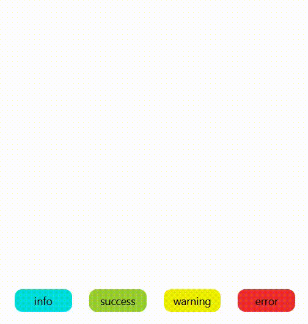

# Notico
A PowerFull and beutifull Library for showing JS Notifications

<div align=center width="300">
    
</div>

## Tutorial

### Step1 : Install Library from NPM or using CDN

#### Install the NPM Library :

you can install the npm package this command :

```sh
npm install notico@1.0.2
```

then add this line into your HTML code :

```sh
<script src="./node_modules/notico/Package/notico.js" defer></script>
```

#### Using CDN :

you can use this script line for using the CDN :

```sh
<script src="https://cdn.jsdelivr.net/npm/notico@1.0.2/Package/notico.js" defer></script>
```

### Step2 : Use Function in HTML or JS Code

#### HTML use :

Create a button like this :
```sh
<button onclick="showToast.info({})">info</button>
```

#### JS use :

Call that function in js :
```sh
showToast.info({});
```

### Step3 : Fill parameters as you like

You can enter your parameters :

```sh
showToast.success({ title: 'success', message: 'This is an success message', time: 7000 });
```

in this function you can write the title, massage and time.

if you do not enter the parameters they would be defaults :

title would be the type, massage would be nothing or "" and time would be 7000 ms.

if your time parameter is smaller than 2000 ms then it ignore yours and would be 2000 ms.
